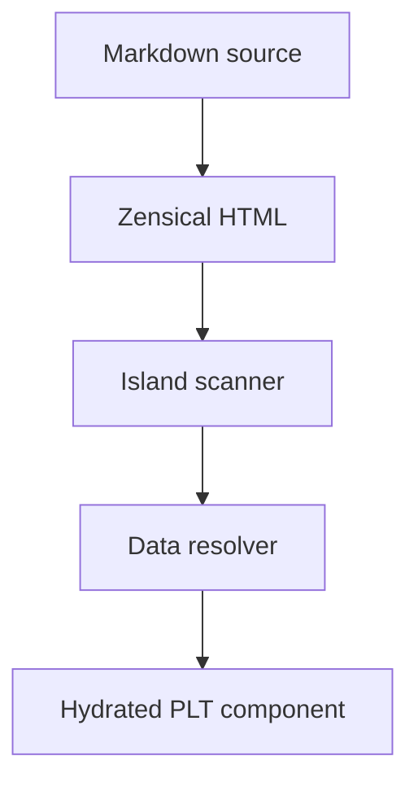

# Store template contract

The PLT store template consumes Zensical output as static HTML plus component island declarations.

## Responsibilities

| Layer | Owns |
| --- | --- |
| Markdown | Page structure, editorial copy, component placement and seed data. |
| Zensical | Static documentation/site generation from Markdown. |
| `@playlovetoys/editorial` | Shared contracts and schemas. |
| `@playlovetoys/design-system` | Visual language, DaisyUI anatomy and reusable renderers. |
| Store template | Data resolution, hydration, Shopify behavior and runtime events. |

## Data flow



## Resolver rules

The template resolves data by component:

| Component | Seed data | Resolver output |
| --- | --- | --- |
| `ProductGrid` | product handles | product-card contracts |
| `ProductCard` | product handle | title, URL, price, image, badge |
| `CollectionCard` | collection handle | title, URL, image, description |
| `FilterBar` | collection handle or facet seed | filter option contracts |
| `Pagination` | page metadata | page links |

The resolver must normalize Shopify data before invoking renderers. Renderers should never receive raw Shopify API objects.

## HTML requirement

Every hydrated section must include:

- `data-plt-island`
- `data-plt-island-id`
- `data-plt-hydrate`
- one `script[type="application/json"][data-plt-props]`

Example:

```html
<div data-plt-island="Newsletter" data-plt-island-id="footer-newsletter" data-plt-hydrate="interaction">
  <script type="application/json" data-plt-props>
    {
      "heading": "Join the list",
      "body": "Get launch notes and educational guides.",
      "placeholder": "EMAIL@EXAMPLE.COM",
      "buttonLabel": "Subscribe"
    }
  </script>
</div>
```

## Non-goals

This contract does not define:

- cart mutation behavior
- authentication
- checkout
- analytics transport
- inventory rules
- product recommendation algorithms
